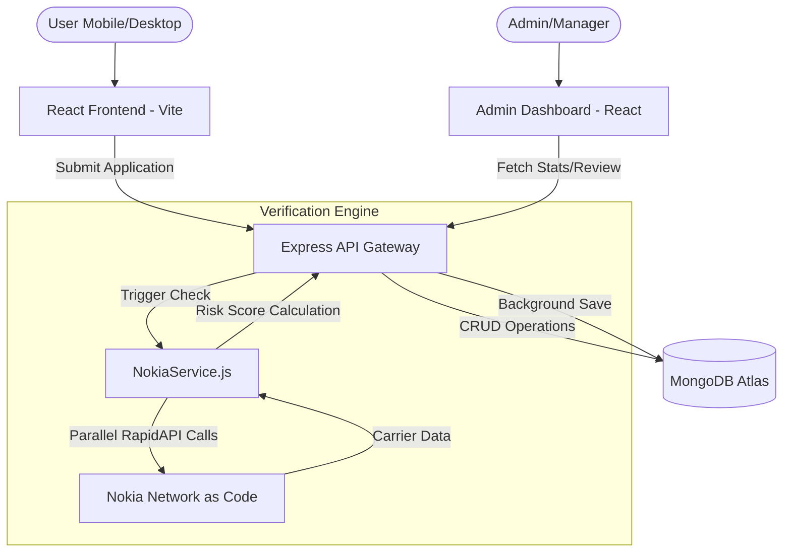

# FinVerif AI: Technical Documentation - Version 1.0

## 1. System Overview
FinVerif AI is a robust, three-tier fintech application designed for real-time fraud detection and automated loan application processing. It uniquely leverages the **Nokia Network as Code (NAC)** ecosystem to integrate telecommunications-grade signals into the risk scoring algorithm.

---

## 2. Technology Stack
- **Frontend (Application Portal)**: React 18.3, Vite 5.4, Tailwind CSS 3.4, Shadcn UI, TanStack Query 5.8, Framer Motion.
- **Admin Dashboard**: React (Centralized dashboard for managers and admins to review applications).
- **Backend (API Core)**: Node.js (Runtime), Express 4 (Web Framework), Mongoose (ODM).
- **Database**: MongoDB (Atlas Cloud for production).
- **3rd Party Integration**: Nokia RapidAPI (NAC - Number Verification, SIM/Device Swap, Location).
- **Infrastructure**: Render/Vercel (Hosting), GitHub Actions (CI/CD).

---

## 3. High-Level Architecture

---

## 4. Database Schema (Schema Key: Application)
Key fields used for the FinVerif engine:
- `user`: Reference to User model.
- `loanAmount`: Number (INR).
- `phoneNumber`: String (Carrier-verified).
- `nokiaVerification`: Object
  - `verified`: Boolean
  - `riskScore`: Number (0-100)
  - `riskLevel`: Enum (Very Low, Low, Medium, High, Critical)
  - `recommendation`: String
  - `rawResults`: Full JSON response from carrier.

---

## 5. Security Protocols
- **API Security**: JWT-based authentication for both Users and Admins.
- **Environment Management**: All API keys (Nokia, MongoDB, JWT) managed via `.env` files and cloud secret managers.
- **Data Privacy**: No sensitive PII (Personally Identifiable Information) is logged. Phone numbers are treated as primary identifiers for carrier verification.
- **Rate Limiting**: Integrated to prevent brute-force attacks on the identification layer.

---

## 6. Automated Fraud Scoring Algorithm
Score weightings in the current engine:
- **Number NOT verified**: +30 points
- **SIM Swap detected (24h)**: +40 points
- **Device Swap detected**: +20 points
- **Location Mismatch**: +10 points
- **Loan Amount Multiplier**: +20% if amount > ₹5,00,000.

---

## 7. API Endpoints
### User Routes
- `POST /api/applications/submit`: Main application entry point.
- `GET /api/applications/nokia-status/:id`: Check real-time verification status.

### Admin Routes
- `GET /api/admin/dashboard/stats`: Global overview.
- `POST /api/applications/admin/verify-nokia/:id`: Manual re-trigger of telco check.
- `PUT /api/admin/users/:id/status`: Freeze/Unfreeze accounts based on risk.

---

## 8. Development & Deployment
- **Local Dev**: `npm run dev` for both frontend and backend.
- **Production Build**: `vite build` for optimized client assets.
- **CI/CD**: Automatic deployment once pushed to GitHub Main branch.
